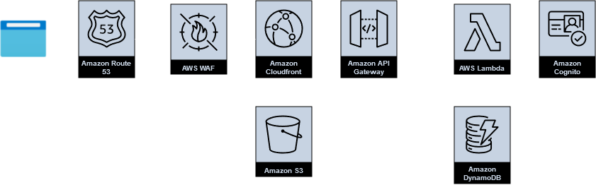

# React Quiz

## About

React Quiz is a demo project I created for hands-on learning of React and AWS.

The application's structure is inspired by AWS certification preparation sites.

This site is still a work in progress as I will continue to fix issues and add new features.

## Tech stack

(copied from [/about-route.tsx](./src//routes/about-route.tsx))

<ul>
    <li>
          <a href="https://react.dev">React 18</a> + <a href="https://vitejs.dev">Vite</a> + <a href="https://www.typescriptlang.org">Typescript</a>
        </li>
        <li>
          <a href="https://reactrouter.com">React Router</a> - Routing
        </li>
        <li>
          <a href="https://tanstack.com/query">Tanstack Query</a> - Backend state management
        </li>
        <li>
          <a href="https://zustand.docs.pmnd.rs">Zustand</a> - Local state management
        </li>
        <li>
          <a href="https://github.com/sindresorhus/ky">Ky</a> - HTTP client
        </li>
        <li>
          <a href="https://react-hook-form.com">React Hook Form</a> - Form management
        </li>
        <li>
          <a href="https://daisyui.com">DaisyUI</a> + 
          <a href="https://tailwindcss.com/">TailwindCss</a> + 
          <a href="https://fontawesome.com">FontAwesome</a> - UI components and styling
        </li>
        <li>
          Hosted on <a href="https://aws.amazon.com/">Amazon AWS</a> - Cloud services provider
        </li>
</ul>

## Frontend features

- Timed quizzes with scoring, auto-pausing on exit, answers review
- Tiered access to resources
  - note: user registration is closed
  - `guest` tier
    - `guest` quizzes
    - results stored in `localStorage`
  - `pro` tier
    - `guest` & `pro` quizzes
    - results stored on backend server
- Navigation
  - navbar + breadcrumbs
  - scroll-to-top button
  - page load: `Suspense` boundaries with loading spinner
  - `/about` route: navigation panel
- UI
  - responsive design
  - alerts/notifications
  - theme switcher
  - theme preference stored in `localStorage`

## Architecture

- static files - Cloudfront &rarr; S3
- `/api/auth/*` - Cloudfront &rarr; Api Gateway &rarr; Lambda &rarr; Cognito
- `/api/cache/*` - Cloudfront &rarr; Api Gateway &rarr; DynamoDB
- `/api/results/*` - Cloudfront &rarr; Api Gateway &rarr; Lambda &rarr; DynamoDB

## Security

- Stateless backend
- Authentication
  - user/password authentication for `pro` users
  - passwordless authentication for `guest` users
  - authentication returns:
    - Cloudfront signed cookies
    - a refresh token
    - a Cognito ID token (for pro users only)
  - refresh tokens enable automatic re-authentication on page refresh or authentication expiry
- Authorization
  - no auth required for static resources
  - Cloudfront signed cookies required for all backend endpoints
  - Cognito token required for data-altering backend endpoints (csrf attacks mitigation)
- all resources hosted under a single domain (= no cors)
- CSP + Trusted Types
- `HttpOnly` / `Secure` / `SameSite=Strict` cookies

## Caching

- `index.html` - cached by Cloudfront
- all other static resources - cached by Cloudfront and the client
- `/api/cache/*` - cached by Cloudfront (separate cache for guest/pro resources)
- `/api/results/*` - no cache
- `/api/auth/*` - no cache

## Run the project locally

- clone this repository
- `npm install` (or better: `pnpm install`)
- create a `.env.development` file based on [.env.development.example](./.env.development.example)
- `npm run dev`
- go to http://localhost:5173

Backend api calls are mocked by MSW.

## Live demo

Hosted on Cloudfront at https://d1rwaskt1lybe5.cloudfront.net/

## Inspired by

- [Bulletproof React](https://github.com/alan2207/bulletproof-react/)
- AWS certification preparation sites such as [TutorialsDojo](https://tutorialsdojo.com/), [ExamPro](https://app.exampro.co) and more
